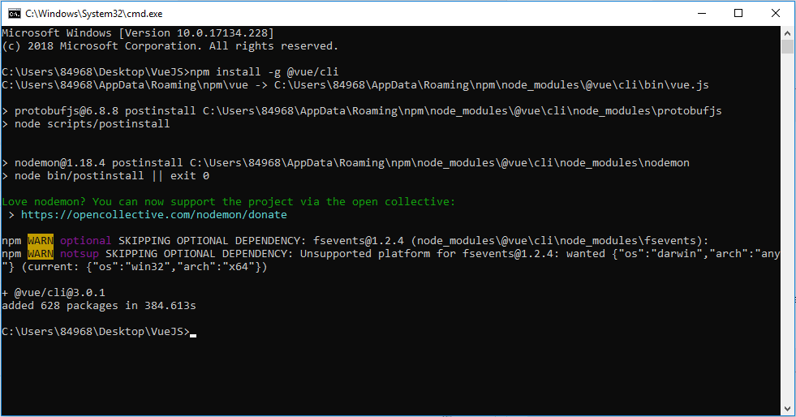
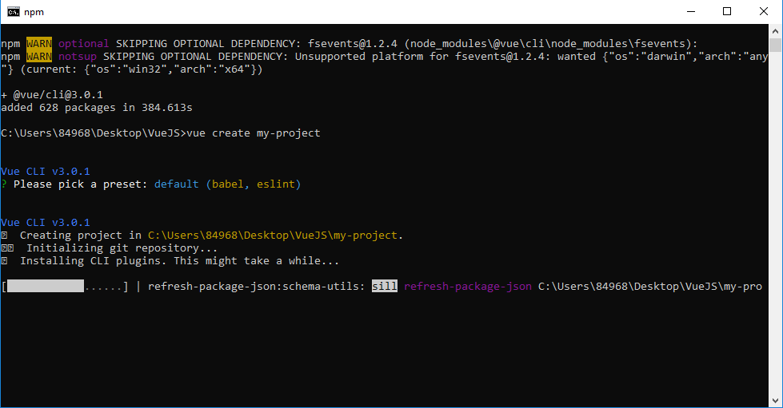
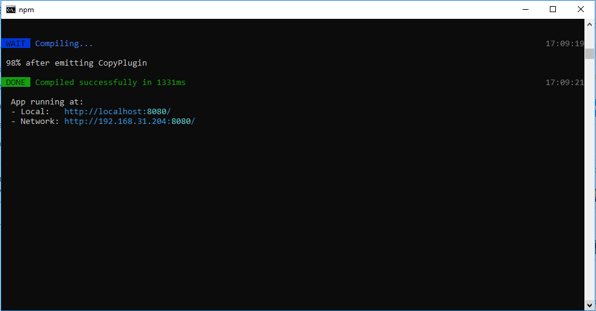

# LẬP TRÌNH  FRONT-END

# VueJS

### I. NỘI DUNG TÌM HIỂU

#### 1. VueJS là gì?
**Vue.js** (View) là 1 thư viện Javascript UI mới (again) đang khá là hot trong thời gian gần đây.
 Vue.js là một framework linh động (nguyên bản tiếng Anh: progressive – tiệm tiến) dùng để xây dựng giao diện người dùng (user interfaces). Vue cũng đáp ứng được dễ dàng nhu cầu xây dựng những ứng dụng một trang (SPA - Single-Page Applications) với độ phức tạp cao hơn nhiều.

  - **Cách sử dụng:** Để sử dụng Vue thì rất là đơn giản. Chỉ cần thêm đoạn script HMTL này vào là bạn đã có thể sử dụng Vue trong trang web

  ```javascript
  <script src="https://unpkg.com/vue@next/dist/vue.js"></script>
  ```
Sau đây là 1 ví dụ tạo 1 instance Vue. Trong đó trường el là trường sẽ được gắn kết.

Dữ liệu để gắn kết tới el đã được định danh ở phía trên sẽ được định nghĩa ở trong trường data, và dữ liệu này sẽ được truy cập qua các template.

Để rõ hơn thì mình có 1 đoạn code HTML như sau:
```html
<div id="app">
  <p>{{ message }}</p>
</div>
```
1 điều cần lưu ý ở đây là thẻ div với id mà chúng ta đã trỏ tới ở phía trên. Và 2 dấu ngoặc nhọn **{{ message }}** được sử dụng để hiển thị dữ liệu được truyền tới.

 ```javascript
  new Vue({
  el: '#app',
  data: {
    message: 'Welcome to Vue.JS!',
  }
})
  ```
 - **Điều kiện**
Vue cung cấp cho chúng ta 1 tính năng khá là hữu dụng như là khả năng binding data tới view theo điều kiện. 

   - Example:

```javascript
new Vue({
  el: '#app',
  data: {
    message: 'Welcome to Vue.JS!',
    // điều kiện
    newMember: true
  }
})
 ```
 ```html
<div id="app">
  <!-- Display chỉ khi newMember = true -->
  <h2 v-if="newMember">{{ message }}</h2>
  <!-- Display chỉ khi newMember = false -->
  <h2 v-else="newMember">Pick a Mentor</h2>
</div>
 ```
**v-if** và **v-else** được dùng cho việc display data theo điều kiện. Và về cách sử dụng thì như là if-else trong các ngôn ngữ lập trình.

- **Vòng Lặp**

Ngoài việc là thực hiện binding theo điều kiện thì Vue cũng có duyệt data theo mảng.
 ```html
<div id="app">
    <ol>
        <li v-for="mentor in mentors">{{mentor.fullname}}</li>
     </ol>
</div>
 ```
Câu lệnh điều hướng **v-for** ở trên tạo 1 biến **mentor** và sử dụng biến này để duyệt hết các phần tử trong array **mentor**.

```javascript
new Vue({
el: '#app',
data: {
  // Array of mentors
  mentors: [
    {id: "1", fullname: "Arup Rakshit"},
    {id: "2", fullname: "Mo Moadeli"},
    {id: "3", fullname: "Khaja Minhajuddin"},
    {id: "4", fullname: "bendozy"},
    {id: "5", fullname: "Massimo Frascati"},
    {id: "6", fullname: "Christian Nwamba"}
  ]
}
})
```
- **Two-Way Binding** trong Vue được sử dụng qua câu lệnh **v-model**. Điều này sẽ thể hiện rõ hơn qua ví dụ.

    - Example:

     ```html
    <div id="app">
        Add mentor:
        <input type="text" v-model="mentor">
         <p>Two-Way Binding Here: {{mentor}}</p>
    </div>
    ```
    ```javascript
    <script>
        new Vue({
            el: '#app',
            data: {
                mentor: ''
            }
        });
    </script>
    ```

- **Xử lí sự kiện** Trong các ứng dụng web thì việc xử lí các sự kiện rất là quan trọng. Gỉa sử như chúng ta cần collect mentor content và status.

  ```html
    <div id="app">
        <p>
            <input type="text" v-model="mentor">
        </p>
        <p>
            <button v-on:click="addMentor">Add Mentor</button>
            <ol>
                <li v-for="mentor1 in mentors">{{mentor1}}</li>
            </ol>
    </div>
    ```
     ```javascript
    <script>
        new Vue({
            el: '#app',
            data: {
                mentor: "",
                mentors: [
                ]
            },

            methods: {
                addMentor: function () {
                    if (this.mentor != "") {
                        this.mentors.push({ 
                            content: this.mentor,
                            status: false
                        })
                        this.mentor = ""
                    }
                }
            }
        })
    </script>
    ```

- **Compenents** là 1 trong những tính năng mạnh mẽ của Vue. Tính năng giúp chúng ta đóng gói các HTML element để tiện cho tái sử dụng trong codebase.

    - Example

```html
    <div>
        <button-counter></button-counter>
        <button-counter></button-counter>
        <button-counter></button-counter>
    </div>
```

```javascript
    Vue.component('button-counter', {
  data: function () {
    return {
      count: 0
    }
  },
  template: '<button v-on:click="count++">Bạn đã bấm {{ count }} lần.</button>'
})
```

#### 2. Vue Cli
 
  - Bước 1: Để chạy được VueJS trên server, ta tạo 1 folder vào thanh local gõ cmd và gõ lệnh **npm install -g @vue/cli**
    - Hình ảnh:
 


  - Bước 2: Chạy tiếp lệnh **vue create my-project** trong đó **my-project** là tên dự án.
    - Hình ảnh:
 


 - Bước 3: Để chạy được VueJS trên sever ta chạy lệnh sau: **npm run serve**
    - Kết quả:
        

 - Bước 4: Chạy Link này trên trình duyệt sẽ thấy giao diện của Vue: <br>
  App running at:
    - Local:   http://localhost:8080/
    - Network: http://192.168.31.204:8080/

### II.	YÊU CẦU

Tự tìm hiểu về VueJS và viết báo cáo những nội dung có liên quan

### III.	NỘP BÀI

- doc: Báo Cáo (README.md).
- Tạo Project trên Github và gửi Link cho người hướng dẫn:
